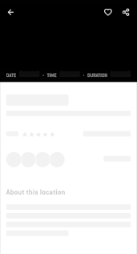
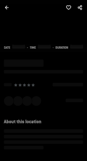

# SkeletonLoading 

[](https://maven-badges.herokuapp.com/maven-central/com.larswerkman/skeletonloading/)

  
A simple way to add Drawable based skeleton loading to your Android app.

* Completely compatible with your current layout
* No custom TextViews or any other views needed.
* Lifecycle aware
* Easily extendable
* Build in Kotlin!

&nbsp;
&nbsp;

 


## Example

```kotlin
class MainActivity : Activity() {

    override fun onCreate(savedInstanceState: Bundle?) {
        super.onCreate(savedInstanceState)
        setContentView(R.layout.activity_main)

        val loading = SkeletonLoading(
            getDrawable(R.drawable.skeleton)!!,
            AlphaAnimation(.1f, .6f)
        )

        loading.register(this)

        val binder = loading.create {
            sample_text_view.skeleton(SkeletonTextView.TextWidth.LINES, 1.2).bind()
        }

        binder.show()
    }
}
```

## Download
```groovy
dependencies {
    implementation 'com.larswerkman:skeletonloading:0.0.7'
    implementation 'com.larswerkman:skeletonloading-views:0.0.7'
    implementation 'com.larswerkman:skeletonloading-animations:0.0.7'
}
```

## License

```text
Copyright 2020 Lars Werkman

Licensed under the Apache License, Version 2.0 (the "License");
you may not use this file except in compliance with the License.
You may obtain a copy of the License at

   http://www.apache.org/licenses/LICENSE-2.0

Unless required by applicable law or agreed to in writing, software
distributed under the License is distributed on an "AS IS" BASIS,
WITHOUT WARRANTIES OR CONDITIONS OF ANY KIND, either express or implied.
See the License for the specific language governing permissions and
limitations under the License.
```